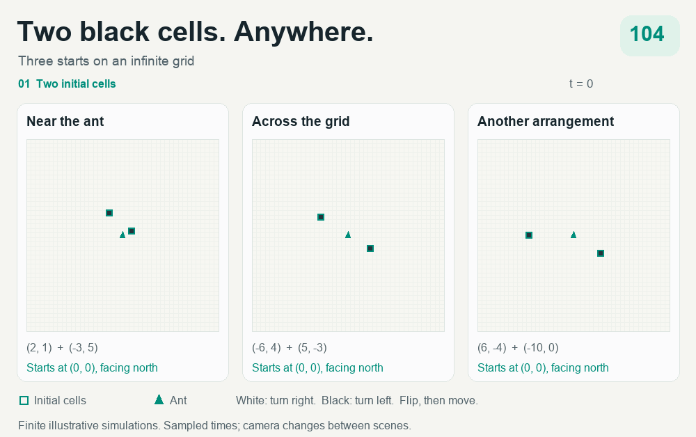

# Two black cells. Anywhere.

**A computer-assisted Lean proof for classical Langton's ant.**

> **Every start with at most two black cells eventually has a translating 104-step cycle.**
>
> The cells may be anywhere on the infinite square grid. The ant may start at any position, facing any direction. After some finite time, its position, heading, and the color it reads repeat every 104 updates, with its position shifted by **two cells along a diagonal**.
>
> **There is no bound on how far apart the cells may be.**

```lean
theorem TwoBlack.theoremA :
  ∀ s, AtMostTwoBlack s → ReachesP104 s
```

[The theorem](lean/TwoBlack/Main.lean) · [Original manuscript](paper/TWO_BLACK_CELLS.md) · [Independent audit](AUDIT.md) · [Literature assessment](docs/LITERATURE_REVIEW.md)



*Three finite simulations of the actual update rule. Teal outlines mark the initial cells; the teal arrow is the ant. Times are sampled, and the last scene zooms in on the ant. [Static preview](docs/assets/two-black.png) · [Animation details and regeneration](docs/ANIMATION.md).*

## The rule

On a white cell, turn right. On a black cell, turn left. Flip the cell's color, then move forward one square. These two rules can produce a long, complicated journey before the repeating diagonal motion begins. “Two black cells” describes the initial board; the ant keeps painting cells as it moves.

## The ideas that make the proof work

**Stretch a checked corridor.** A highway segment connects regions of old debris. The corridor lemma proves that making this segment one period longer inserts one extra period each time the ant crosses it. The surrounding behavior follows the checked run. Induction then settles every longer member of that family, including arbitrarily distant initial cells. The required cases include return trips and two interacting corridors.

**Account for every second-cell encounter.** Once the first initial black cell is encountered, the proof classifies where the second can affect the journey: near old debris, along a corridor, or farther along a highway. The classification has finitely many descriptions of infinite families. Lean checks both the families' certificates and the argument that they cover every relevant placement. Cells that are never read are handled by a separate coupling argument.

**Use a certificate that lasts forever.** A checked period agrees with its translated successor in a suitable half-plane. The half-plane argument proves that this agreement continues for every future period. These certificates underpin the corridor and coverage arguments.

The new work is the corridor calculus and the exhaustive second-cell classification. Hao Ke's earlier unrestricted one-black-cell theorem is the closest predecessor; this artifact supplies its own proof of that case along the way. See [acknowledgements](ACKNOWLEDGEMENTS.md), the [plain-English explanation](docs/PLAIN_ENGLISH.md), and the [formal proof map](docs/PROOF_MAP.md).

## Check the result yourself

Install [elan](https://github.com/leanprover/elan) and a working native C compiler/linker, then run:

```sh
git clone https://github.com/imfinn/langton-two-black.git
cd langton-two-black
elan toolchain install leanprover/lean4:v4.30.0
bash ./scripts/validate.sh --clean
```

This builds the proof from source, prints the actual axioms of `theoremA`, and runs the mutation tests. The proof uses **Lean 4.30.0, core/Std, and no external Lean packages**. The audited clean build took about 91 minutes on the documented Mac; other machines will differ.

For the axiom report after building:

```sh
cd lean
lake env lean TheoremAAxioms.lean
```

[Full reproducibility instructions](REPRODUCIBILITY.md) cover data regeneration and independent C++/Python checks. The manual GitHub Actions workflow **Validate theoremA** performs a fresh source build; it is computationally substantial.

## What is certified, and what is trusted?

The independent audit found no authored proof holes or checker bypasses. The infinite-family reasoning and final assembly are checked by Lean. Finite obligations use `native_decide`, which trusts compiled execution. The actual theorem dependency report contains **three standard axioms and 61 generated native-computation axioms**. [TRUST.md](TRUST.md) explains this boundary.

`ReachesP104` asserts eventual periodicity of the ant's position, heading, and read color with a drift `(±2, ±2)`. Identification with the blank-start highway's exact turn word is separate external computational evidence. The general conjecture for an arbitrary finite number of initially black cells remains open.

## Explore the repository

| Path | Contents |
|---|---|
| [lean/](lean/) | Preserved proof, generated check data, pinned toolchain and Lake configuration |
| [paper/](paper/) | Original revision-4 manuscript, preserved byte-for-byte |
| [AUDIT.md](AUDIT.md) | Independent verdict, checks, defects found and maintainer repairs |
| [docs/LITERATURE_REVIEW.md](docs/LITERATURE_REVIEW.md) | Evaluation against published work and public research artifacts |
| [docs/MANUSCRIPT_REVIEW.md](docs/MANUSCRIPT_REVIEW.md) | Detailed comparison of manuscript sections 9–10 with the artifact |
| [audit/2026-10-05/](audit/2026-10-05/) | Fresh build logs, axiom reports, mutation results and manifests |
| [code/](code/), [scripts/](scripts/), [tests/](tests/) | Generators, independent checks and validation helpers |
| [runs/](runs/) | Preserved upstream dumps and historical logs, labelled separately from fresh evidence |

Novelty is qualified by the manuscript's “to our knowledge” wording. [PROVENANCE.md](PROVENANCE.md) records the supplied artifact, preservation policy and licensing status.
