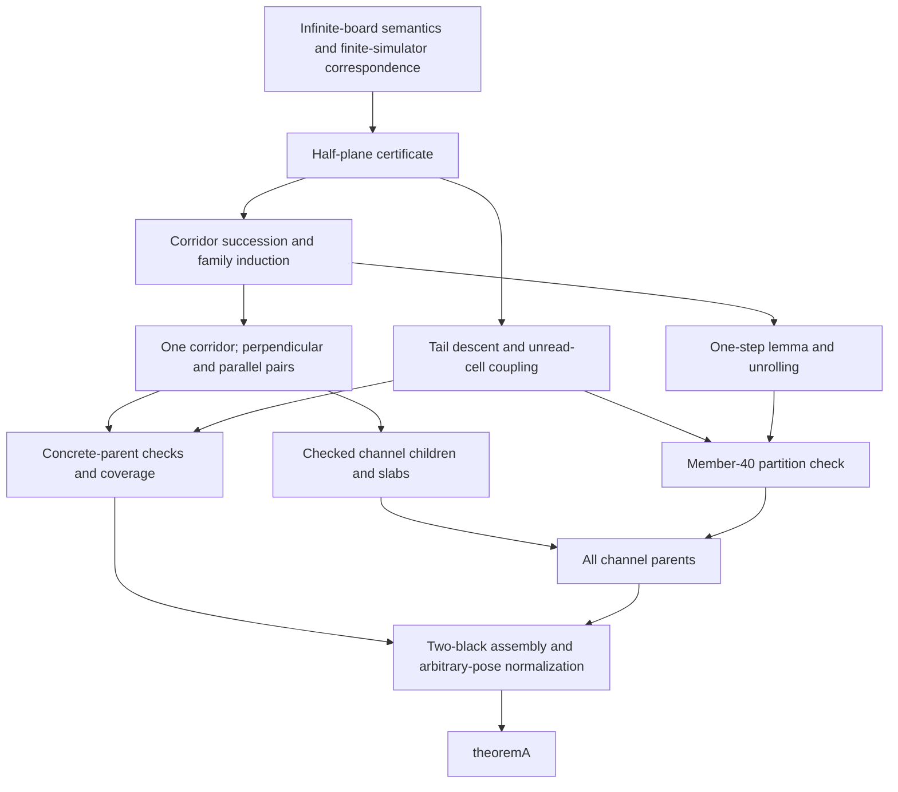

# Proof and computation map

This map describes the supplied revision-4 source. All names below are in namespace `TwoBlack`. A successful clean build and the actual axiom report are required in addition to this source inspection; see `AUDIT.md`.

## Meaning of the statement

`Basic.lean` defines `Pt` with two `Int` coordinates and `State` with `black : Pt → Bool`, `pos : Pt`, and `dir : Dir`. The board is infinite; a state's board need not be finitely supported until a cardinality premise is imposed. North is positive y. Each `step` reads the cell under the ant, turns right on white or left on black, flips that cell, and then moves one unit in the new heading. `run` iterates that rule over natural-number time.

`AtMostTwoBlack s` in `TheoremA.lean` means that there exists a list of at most two points whose membership function equals `s.black` at every point. Repeated points are allowed and harmless. This is equivalent to at most two distinct black cells. No restriction is placed on the coordinates, their distances, the ant's position, or its heading.

`Highway.lean` defines the four standard drifts as `(2,2)`, `(2,-2)`, `(-2,2)`, and `(-2,-2)`. An observation consists of position, heading, and the color under the ant. `PermanentP104 s` means that for one such drift v, every cycle c and phase ph < 104 satisfies

```text
observe(run (104*c + ph) s) = shift(c*v, observe(run ph s)).
```

`ReachesP104 s` means this holds after some finite number of updates. This is observation periodicity, with the stated 104-step drift. The conclusion does not specify the entire board up to translation, the blank-board highway's particular turn word, or a proof that 104 is the least possible observation period.

`Pose.lean` proves that translating the board and ant together, and rotating them by quarter turns, commutes with `step` and `run` and preserves the conclusion. `canonCell` subtracts the ant position and rotates the heading to north. `reaches_of_canonical` restores the original pose. The final cardinality theorem considers empty, singleton, and two-point lists; duplicate points reduce to one black cell.

## General soundness chain

| Layer | Source and main declarations | What the ordinary Lean proof establishes |
|---|---|---|
| Faithful finite simulator | `Check`: `FState.step_toState`, `frun_toState`, `FState.init_toState` | The hash-set simulator represents the infinite-board transition exactly. `agreeB_sound` checks both black supports, hence also accounts for white cells outside them. |
| Coupling | `Coupling`: `agree_step`, `agree_run`, `black_untouched` | Agreement on a region transports observations as long as reads stay there; unread cells remain unchanged. |
| Half-plane certificate | `Highway`: `halfplane_forever`, `halfplane_obs`, `reaches_of_certificate` | A translated agreement across one period in a translation-closed region, with all period reads inside it, implies agreement and translating observations forever. The 104-step standard-drift instance gives `ReachesP104`. |
| One corridor | `Corridor`: `Rid`, `Rtr`, `CorridorHyp`, `corridor` | Overlapping near/far relations, switch pose agreement, strip agreement, separation, and all-time zone bounds transport a run through any number of switches. The final interval is unbounded in time. |
| Corridor succession | `Succ`: `corridor_reaches`, `corridor_succ`, `corridor_family` | One corridor can be lengthened repeatedly: its far threshold increases by 4 and switch j is delayed by 104*j each time. Induction proves all natural-number family parameters. |
| One-corridor checker | `Check`: `check1_sound`, `fam_init` | Finite simulation verifies switches, board strips, initial relations, and the certificate. Certificate periodicity plus the tail sign extends the finite zone checks to all time. |
| Perpendicular corridors | `Perp`: `H1p_succ`, `perp_succ`, `perp_family`; `Check2`: `check2p_sound` | Zero cross-projection of the drifts, ordered disjoint windows, and initial block inequalities preserve the other corridor's conditions. Double induction proves every pair of parameters. |
| Parallel corridors | `Par`: `ParHyp`, `par_succ`, `par_family`; `Check2Par`: `check2par_sound`, `colOkB` | Side, band, foreign-read zone, and drift-sign conditions transport the second corridor; its zones shift by the cross-projection when required. Per-block inequalities prove the initial relation for every row. Double induction covers both parameters. The proof uses a sufficient version of paper H3 without its extrema clause. |
| Tail descent | `Tail`: `descent_step`, `descent`, `reaches_add_unread` | An arbitrary late first read descends by any number of 104-step periods to a finite tail window; adding a cell never read preserves the observations. |
| Concrete parent | `Parent0`: `certAt_sound`, `certLoop_sound`, `certB_sound`, `famFor_sound`, `loop0_sound`, `check0_sound` | Direct searches return actual half-plane certificates, not merely long simulations. A parent check covers every second cell not read before divergence: unread forever, finite first-read range, or arbitrary tail depth. Raised family bases are filled with direct certificates. |
| Concrete table coverage | `TheoremA`: `coverLoop_sound`, `concrete_of_table` | Every required blank-run first read before `blankT2 = 14976` has a checked matching parent and a suitable divergence bound. The checker permits unused trailing entries and does not use `PEntry.tau`; it proves coverage, not the converse/exactness of the table. |
| Channel reduction | `Remaining`: `deep_is_channel`, `ChildPartition1`, `channelParentsOK_of` | Every late blank first read lies on one of the listed channels. A partition supplying some verified child for each visited second cell, or proving it unread forever, gives `ChannelParentsOK`. Neither disjointness nor uniqueness of children is required. |
| Child family connection | `Channels`: `Kid1.reaches`; `PerpKids`: `perpOK_sound`, `perpCovered_sound`; `Check2Par`: `parOK_sound`, `parCovered_sound` | Child list membership is tied to the exact checked family, including its base. Slabs below raised two-dimensional bases are covered by checked one-dimensional families. Empty or mismatching proof tables cannot cover the required children. |
| Channel succession | `Step`: `StepHyp.step_first`, `StepHyp.step_new`, `step_chain`, `blank_facts`, `pos_eq_blank_upto`, `posmap2`, `unroll` | First block-read times and subsequent new cells transport between members; the hypotheses hold at every depth, using the blank run before the block and transported positional return periodicity. `perLoop` checks positions, not full observations; the other corridor/certificate conditions supply the observation conclusion. This does not assume F1 or Lemma 6.2. |
| Channel partition | `PartCheck`: `checkPart_sound` | Checking member 40, one/two switch structure, correct first block read, D ≥ 19, return periodicity, near tail, descent margin, and finite/tail child membership yields `ChildPartition1` for every member j ≥ 40. Fixed, split, moving, and tail child forms are matched to their exact lists and bases. |
| Final assembly | `Final`: `two_black`, `two_black'`, `two_black''`, `two_black_final`; `Main`: `theoremA` | Concrete and channel parents cover whichever initial black cell the blank run reads first. Cells never read are handled separately. All parent and child obligations are discharged; pose normalization covers arbitrary position and heading. |

A finite cutoff, a certificate-search budget, a family base such as 40, or a finite set of switch times is a checker parameter. None imposes a radius, an upper bound on a family parameter, or a bound on the positions in `theoremA`.



The fresh generic axiom audit distinguishes two layers: `check1_sound`, `check0_sound`, `check2p_sound`, and `check2par_sound` use only standard axioms; `checkPart_sound` is an ordinary proof that also uses the already verified concrete blank-run fact through `blank_facts` / `blank_check`. `step_chain`, `unroll`, and the generic one-step lemmas themselves use only standard axioms. The precise one-step names are `StepHyp.step_first` and `StepHyp.step_new`.

## The 61 computation premises

`native_decide` establishes closed Boolean equalities, using compiled execution. Their ordinary soundness theorems then prove the mathematical statements. The fresh `#print axioms theoremA` confirms the following grouping:

| Check | Calls | Literal inputs |
|---|---:|---|
| Blank parent `blank_check` and blank certificate `blank_reaches` | 2 | `OneBlack.lean`: `blankHint`, empty board, budgets; `Level1Data.lean` |
| `level1_checks` | 1 | 22 `Fam1 × Hint1` entries in `Level1Data.lean` |
| `chunk0_ok` through `chunk31_ok` | 32 | 2,432 `PEntry` values in `Parents/Chunk*.lean`, with 53,504 tail-family hints |
| `chan0_ok` through `chan21_ok` | 22 | 45,452 one-parameter children in `Chan/Data*.lean`, including base and hint values |
| `perp_covered` | 1 | `chanTable` and 286 perpendicular entries, including 120 slab hints, in `PerpData.lean` |
| `par_covered` | 1 | `chanTable` and 220 parallel entries, including 452 slab hints, in `ParData.lean` |
| `cover_ok` | 1 | `parentTable`, blank simulator, cutoff 14976 |
| `part_checks` | 1 | 22 entries in `PartData.lean`, the parent list and all child families |
| Total | 61 | Source literals, all compiled afresh by the build |

These are 61 aggregate checks, not 61 simulated states. `PartMut.lean` and the added audit tests use further native computations in separate test modules; they do not occur in the theorem's dependency graph.

## External inputs and provenance

No checker calls C++, Python, a shell command, or file IO during the Lean proof build. All computation inputs are Lean literals in the source files just listed, compiled modules of this same project, and Lean 4.30.0's core/Std libraries. A clean build regenerates the project's compiled modules and native libraries.

The upstream C++ generator produces `leandump`, `chandump`, `perpdump`, and `pardump`; `gen_lean_*.py` converts these to Lean literals. `gen_lean_hints.py` derives the 22 initial family hints from C++ inspection plus Python simulation. `gen_lean_part.py` independently replays finite membership coverage before writing partition hints. The compressed dumps in `runs/` preserve these upstream inputs. They are regeneration inputs, not runtime inputs to `theoremA`.

Lean verifies every fact needed from these literals: dynamics, certificate relations, family conditions, finite coverage, actual child membership, slab coverage, and the partition. It does not certify the generator programs, their console summaries, exact counts of ant updates, minimal/maximal transit statistics, F1, uniqueness of a partition, or the particular standard turn word. Those are separate computational or documentary claims.
